  

# 🤖 I'M RAHUL!

*AI Engineer (Voice & Chat Agents)*

I build AI agents that talk to people — on phone calls, WhatsApp, Instagram, email and the web — with a huge love for **Python**, **LangGraph**, **LiveKit**, **FastAPI**, **RAG**, **SIP/WebRTC** and everything real-time.

- 📞 Built a Voice AI agent making **1M+ calls a month** in **10 Indian languages**
- 💬 Shipped **15+ production chat agents** for fintech, healthcare, real estate & e-commerce
- 🔬 I debug down to the packets — fixed a carrier-level TCP bug in **[LiveKit's SIP bridge](https://github.com/rahul20110/sip)** and rebuilt call recording as an in-process service
- 📦 Author of **[fika-langwatch](https://pypi.org/project/fika-langwatch/)** & **[fika-logger](https://pypi.org/project/fika-logger/)** on PyPI
- ⚡ Cut voice-pipeline cost **26% per minute** through obsessive benchmarking
- 🌱 Currently exploring predictive dialers & Kubernetes autoscaling for 1,000+ concurrent calls
- 📫 Reach me at **rahul20110@iiitd.ac.in**

 

## 🛠️ Languages and Tools

  
  
  
  
  
  
  
  
  
  
  
  
  
  
  
  

## 🚀 What I've Shipped

| | Project | What it does |
|---|---|---|
| 📡 | [`rahul20110/sip`](https://github.com/rahul20110/sip) | Fork of LiveKit's SIP bridge — carrier-level TCP framing fix + call recording as an **in-process service** (stereo PCM → WAV → S3, no separate egress server) |
| 🛟 | [`fika-langwatch`](https://pypi.org/project/fika-langwatch/) | Automatic LLM fallback chains for LangChain — per-key health tracking, recovery detection, Slack/email alerts |
| 📋 | [`fika-logger`](https://pypi.org/project/fika-logger/) | Structured logging for agent fleets — error dedup, trace IDs, auto-opens GitHub issues on new failures |

## 📊 GitHub Stats

  
  

## 🤝 Connect with Me

  
  
  

  ⚡ If it involves agents, hard latency budgets, or a bug nobody can find — I want to hear about it.

