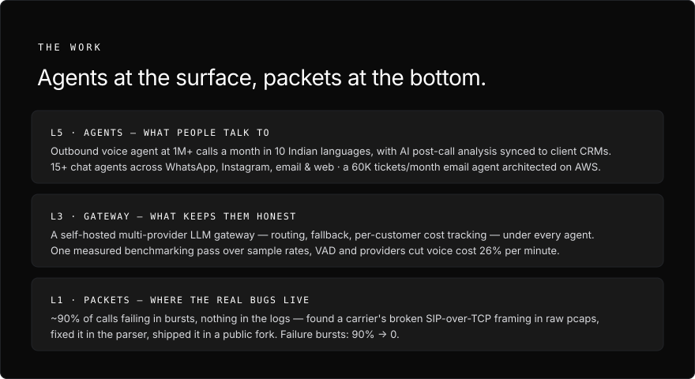
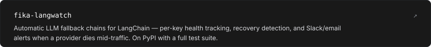
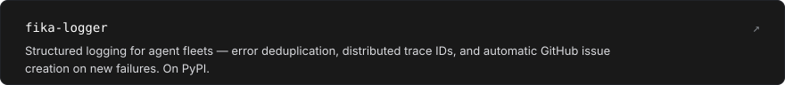
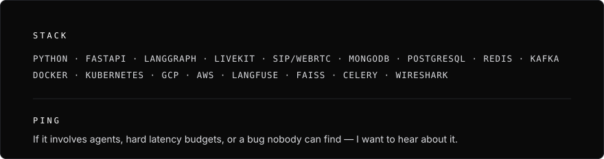

  

  &nbsp;
  &nbsp;
  

  

  

  

  

  

  

  <a href="https://linkedin.com/in/jhajharia110">LinkedIn</a> &nbsp;·&nbsp; <a href="mailto:rahul20110@iiitd.ac.in">rahul20110@iiitd.ac.in</a> &nbsp;·&nbsp; <a href="https://github.com/rahul20110/sip">rahul20110/sip</a>

